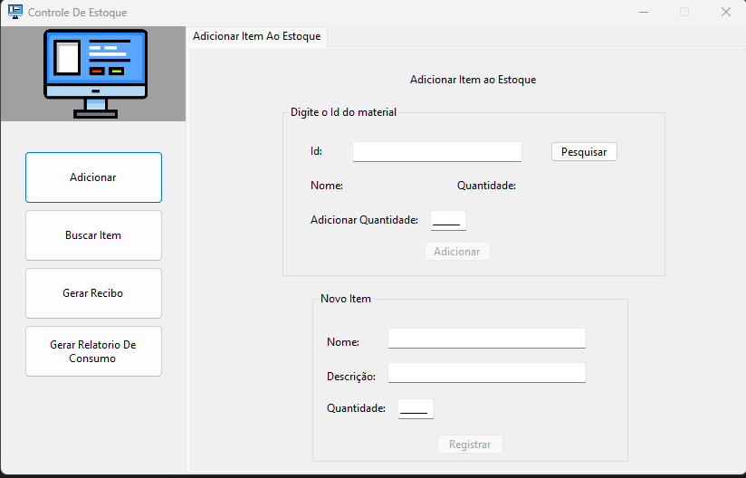

# MeuEstoque
 
## Descrição
MeuEstoque é uma aplicação desenvolvida em Windows Form utilizando .NET 6 e C#. Inspirada na nostalgia das interfaces dos anos 90, especialmente nas janelas do Windows, esta aplicação é ideal para aqueles que compartilham do mesmo carinho por essa época. 
## Motivação
Como entusiasta dos computadores dos anos 90, o desenvolvedor desta aplicação encontrou inspiração na simplicidade e familiaridade das interfaces daquela era. Embora possa parecer um tanto "cringey" para os jovens de hoje, a experiência do usuário proporciona uma sensação nostálgica e agradável para quem viveu a era dourada da computação. 
## Funcionalidades 
 ### 1. Adição de Itens ao Banco de Dados LocalDB 
 
MeuEstoque permite a fácil adição de itens ao banco de dados localDB. Com uma interface intuitiva e amigável, você pode inserir informações detalhadas sobre os produtos que compõem o estoque. 
 ### 2. Controle de Estoque 
 A aplicação oferece funcionalidades robustas para o controle de estoque. Você pode visualizar, editar e remover itens do estoque, mantendo sempre as informações atualizadas. 
 ### 3. Geração de Relatórios 
 MeuEstoque facilita a geração de relatórios detalhados sobre o estoque. Esses relatórios fornecem insights valiosos, como a quantidade atual de cada produto, histórico de vendas e outras métricas relevantes. 
 ### 4. Geração Automática de Recibos 
 Simplificando ainda mais o processo de vendas, MeuEstoque automatiza a geração de recibos. Isso proporciona eficiência e precisão, poupando tempo e evitando erros humanos. ## Requisitos do Sistema  - Sistema operacional: Windows - .NET Runtime: Versão 6 ou superior 
 ## Como Instalar e Executar 